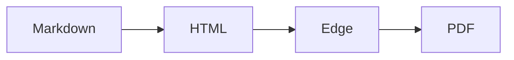

[[_TOC_]]

# 1. Introduction

This is the test document for the end-to-end suite, and a handy sample. It exercises headings, numbered section references, tables, code, diagrams, alerts, inline HTML,
images, footnotes and links. The formatting rules are described in §2, and diagrams in §3. The alert styles
are listed in §4.1, §4.2 and §4.3. A reference such as design.md §9 points into another file, so it stays plain text.

Short paragraphs keep the layout predictable. Each chapter below has enough text to fill part of a page, so the
book layout produces a cover, a contents page and chapters that each start on a new page.

## 1.1 Goals

- [x] Render CommonMark with tables, strikethrough and task lists
- [x] Link numbered references such as §2.1 to their headings
- [ ] Never cut content off at the right edge of the page

## 1.2 Non-goals

md2pdf is not a general typesetting system. It lays out Markdown for reading on a tablet or on paper, and it
keeps ~~every~~ most decisions automatic so that a document converts well without any configuration.

# 2. Formatting

Text can be **bold**, *italic*, `inline code`, <kbd>Ctrl</kbd>+<kbd>P</kbd>, H<sub>2</sub>O and x<sup>2</sup>.
A long identifier such as `SomeVeryLongConfigurationSettingNameThatNeedsToWrap` must wrap instead of overflowing.

## 2.1 Tables

| Device | Width (mm) | Height (mm) | Body text | Notes |
|---|---:|---:|---:|---|
| paper-pro | 180 | 240 | 11 pt | the default |
| rm2 | 157.5 | 210 | 10.5 pt | reMarkable 2 |
| move | 91.8 | 163.2 | 9.5 pt | the small one |

A wide table is shrunk or squeezed to fit the page:

| Col A | Col B | Col C | Col D | Col E | Col F | Col G | Col H | Col I | Col J |
|---|---|---|---|---|---|---|---|---|---|
| alpha-value-one | beta-value-two | gamma-value-three | delta-value-four | epsilon-value-five | zeta-value-six | eta-value-seven | theta-value-eight | iota-value-nine | kappa-value-ten |
| 1 | 2 | 3 | 4 | 5 | 6 | 7 | 8 | 9 | 10 |

## 2.2 Code

```python
def greet(name: str) -> str:
    # comments are styled differently
    return f"Hello, {name}!"
```

```powershell
Get-ChildItem -Path C:\docs -Filter *.md | ForEach-Object { .\md2pdf.cmd $_.FullName -o C:\pdfs -d paper-pro --layout book }  # a long line
```

```text
A plain text block whose single line is far too long to fit on the page at any readable size, so md2pdf has to wrap it rather than shrink it below the smallest font size it allows for code.
```

# 3. Diagrams

A fenced mermaid diagram:



An Azure DevOps wiki mermaid block:

::: mermaid
sequenceDiagram
  User->>md2pdf: notes.md
  md2pdf->>Edge: print
  Edge-->>User: notes.pdf
:::

# 4. Alerts and HTML

## 4.1 Notes and tips

> [!NOTE]
> Notes carry extra information.

> [!TIP]
> Tips suggest a better way.

## 4.2 Warnings

> [!WARNING]
> Warnings need attention.

> [!CAUTION]
> Cautions describe risks.

## 4.3 Inline HTML

<details>
<summary>Expandable section</summary>

Details are printed expanded, because a PDF cannot be clicked open.

</details>

<script>document.title = "unsafe"</script>
<button onclick="alert(1)">Button tags are removed but their text stays.</button>
<a href="javascript:alert(1)">A script link keeps only its text</a>

# 5. Images and links

A relative image with an Azure DevOps size: 

A wiki-rooted image: 

Links: [external site](https://example.com), [a heading in this file](#2-formatting),
[another document](other.md), and a bare URL https://example.org/path?q=1.

A statement with a footnote.[^1]

[^1]: Footnotes are collected at the end of the document.

#Appendix

The heading above has no space after the hash, which Azure DevOps wiki treats as a heading.
